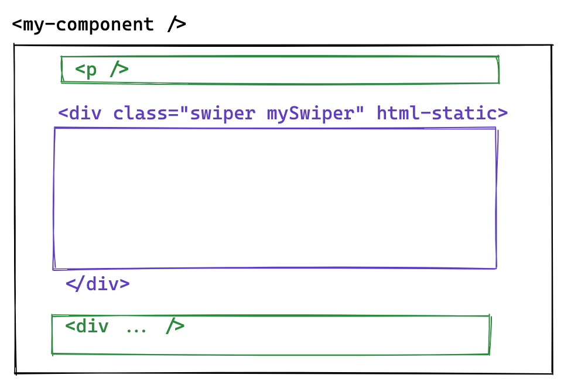

# html-static

> A special directive to create static areas inside your component `HTMLElement`.

You can bypass dom diffing using `html-static` property, the Jails template system will notice that attribute and bypass virtual dom changes on the specific node and his children. Its pretty handy specially when you need to integrate your component with some UI library, like [Swiper](https://swiperjs.com/).

 

    

 

!> Its also usual to use `html-static` property in form elements like : `input`, `textarea`, `select` etc, in order to let the browser persists value instead of having to handle the values yourself using state variables, or in along with vanilla lazy load images libraries.

    <iframe width="100%" height="500" src="https://stackblitz.com/edit/jails-swiper-integration?file=index.ts"></iframe>

