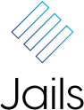

	
	

- Getting Started
    - [Introduction](/)
    - [Installing](installing.md)
	- [Usage](usage.md)

- Component
	- [Main](main.md)
	- [Elm](elm.md)	
	- [Events](events.md)
	- [Pub/Sub](pubsub.md)
	- [Expose/Get](expose-get.md)
	- [Dependency Injection](dependencies.md)

- Template System
	- [Reactor](reactor.md)
	- [Node Updates](node-updates.md)
	- [Parent & Children Updates](parent-children.md)

- Animations
	- [Introduction](animation.md)

- State Management & Architecture
	- [Introduction](state.md)

- Store
	- [Introduction](store.md)

- Packages
	- [Introduction](packages.md)